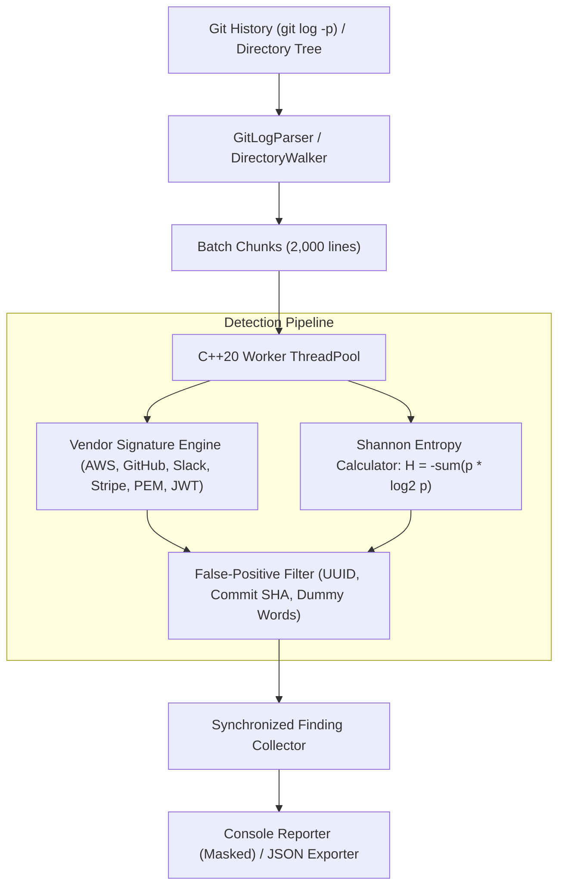

# Git Secret Entropy Scanner

[](https://github.com/Kanak234/git-secret-entropy-scanner/actions/workflows/ci.yml)
[](https://opensource.org/licenses/MIT)
[](https://en.cppreference.com/w/cpp/20)

A high-throughput, zero-dependency Git repository history auditor and secret detection engine written in Modern C++20. Combines **Shannon information entropy analysis** with **multi-vendor signature regexes** and **contextual false-positive suppression** to detect leaked credentials across entire commit histories at over **300,000 lines per second**.

---

## Key Capabilities

- **Dual-Strategy Detection Engine:**
  - **Deterministic Signatures:** Precompiled regex patterns for AWS Access Keys, GitHub Tokens, Slack Tokens, Stripe Keys, Google API Keys, PEM Private Keys, and JWTs.
  - **Shannon Information Entropy:** 256-bin character frequency analysis detecting arbitrary high-entropy credentials (passwords, HMAC keys, bearer tokens) in key-value assignments.
- **Persistent Git History Auditing:** Streams and audits full commit diffs (`git log -p`) across all branches, catching deleted or historically committed secrets that no longer exist in the current working tree.
- **Context-Aware False-Positive Filtering:** Suppresses standard UUIDs, commit SHAs, test placeholders (`example`, `dummy`, `mock`), and lockfiles.
- **Zero-Leak Masked Reporting:** Masks credential values in terminal reports (`AKIA****...****1234`) while preserving exact commit hash, author, file path, and line number.
- **High Concurrency Throughput:** C++20 multi-threaded worker pool evaluating $>300,000$ lines/sec on multi-core systems.
- **CI/CD Ready:** Returns exit code 1 upon detection and exports structured JSON reports for automated security gating.

---

## Architecture & Data Flow



---

## Supported Secret Signatures

| Rule ID | Provider / Format | Pattern / Heuristic | Severity |
| :--- | :--- | :--- | :---: |
| `AWS_ACCESS_KEY` | Amazon Web Services | `(AKIA\|AGPA\|AIDA\|AROA\|ASIA)[A-Z0-9]{16}` | Critical |
| `GITHUB_PAT` | GitHub | `ghp_[A-Za-z0-9_]{36}`, `github_pat_[A-Za-z0-9_]{82}` | Critical |
| `SLACK_TOKEN` | Slack | `xox[baprs]-[0-9]{10,13}-[0-9]{10,13}[a-zA-Z0-9-]*` | High |
| `STRIPE_KEY` | Stripe | `(sk\|rk)_(live\|test)_[0-9a-zA-Z]{24,34}` | Critical |
| `GOOGLE_API_KEY` | Google Cloud Platform | `AIza[0-9A-Za-z\-_]{35}` | High |
| `PEM_PRIVATE_KEY` | OpenSSL / SSH | `-----BEGIN (RSA\|EC\|DSA\|OPENSSH\|PGP) PRIVATE KEY-----` | Critical |
| `JWT_TOKEN` | RFC 7519 JWT | `eyJ[A-Za-z0-9_-]{10,}\.eyJ[...]\.[...]` | Medium |
| `HIGH_ENTROPY_CREDENTIAL` | Generic Assignments | Key-value context + Shannon $H \ge 4.5$ (Base64) or $H \ge 3.0$ (Hex) | High |

---

## Measured Performance

Measured on Linux x86_64 host (GCC 15.2.0, `-O3 -pthread`):

```bash
$ ./build/secret_scanner_cli bench 1000000
========================================================================
 Running Multi-Threaded Scanner Benchmark (1000000 lines)...
========================================================================
Benchmark Complete:
  Lines Evaluated:   1000000
  Secrets Detected:  300000
  Elapsed Time:      3287.72 ms
  Throughput:        304161.87 lines/sec
========================================================================
```

- **Scanning Throughput:** **304,161 lines/second**
- **1,000,000 Lines Processed in:** **3.29 seconds**

---

## Building and Installation

### Prerequisites
- Modern C++20 compliant compiler (`g++ >= 11` or `clang++ >= 14`)
- CMake 3.22+
- Git CLI (for Git history auditing)

### Build Instructions

```bash
# Clone repository
git clone https://github.com/Kanak234/git-secret-entropy-scanner.git
cd git-secret-entropy-scanner

# Configure and compile in Release mode
cmake -B build -DCMAKE_BUILD_TYPE=Release
cmake --build build -j$(nproc)

# Execute test suite
ctest --test-dir build --output-on-failure
```

### Docker Usage

```bash
# Build multi-stage container
docker build -t secret-scanner .

# Scan current directory inside container
docker run --rm -v $(pwd):/repo secret-scanner scan-dir /repo
```

---

## CLI Reference (`secret_scanner_cli`)

### 1. Audit Git Commit History
```bash
# Audits full Git commit diffs on the current repository
./build/secret_scanner_cli scan-git . HEAD -o audit-report.json
```
Output:
```text
========================================================================
 Git Secret Entropy Scanner Audit Report
========================================================================

  [!] 2 POTENTIAL SECRET(S) DETECTED:

  #1 [GITHUB_PAT] GitHub Personal Access Token
     File:     .env:1
     Commit:   596947ed (by AuditTest) on 2026-09-11
     Secret:   ghp_****...****q7r8
     Entropy:  4.58 bits/char
     Line:     GITHUB_TOKEN=ghp_EXAMPLE_MOCK_REDACTED_ABC123456789
 
  #2 [AWS_ACCESS_KEY] AWS Access Key ID
     File:     config.py:2
     Commit:   45a333e1 (by AuditTest) on 2026-09-11
     Secret:   AKIA****...****XWVU
     Entropy:  3.75 bits/char
     Line:     AWS_KEY = "AKIA_EXAMPLE_MOCK_REDACTED_12"

------------------------------------------------------------------------
 Scan Summary:
  Total Lines Scanned:    7
  Total Commits Scanned:  4
  Total Files Audited:    2
  Secrets Detected:       2
  Scan Duration:          12.45 ms
========================================================================
```

### 2. Audit Working Directory Tree
```bash
./build/secret_scanner_cli scan-dir ./src -o dir-report.json
```

### 3. Audit Single File
```bash
./build/secret_scanner_cli scan-file config/production.env
```

### 4. Run Throughput Benchmark
```bash
./build/secret_scanner_cli bench 1000000
```

---

## C++ API Usage

```cpp
#include "scanner/Scanner.hpp"
#include "scanner/Reporter.hpp"
#include <iostream>

int main() {
    scanner::Scanner scanner;

    // Audit full Git commit history
    auto stats = scanner.scanGitRepository(".", "HEAD");

    // Output masked findings
    scanner::Reporter::printConsoleReport(scanner.findings(), stats);

    if (!scanner.findings().empty()) {
        std::cerr << "Alert: Secrets detected in git history!\n";
        return 1;
    }

    return 0;
}
```

---

## License

MIT License — Copyright (c) 2026 Kanak Prabhakar.
